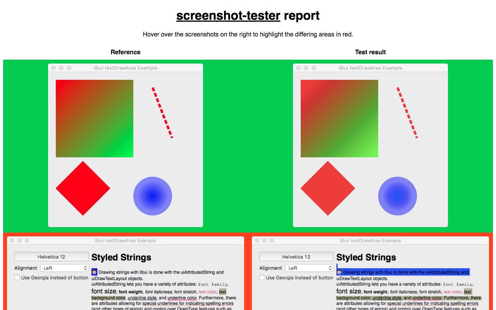

# screenshot-tester

Take screenshots (= snapshots) of desktop (node) apps (i.e. [libui-node](https://github.com/parro-it/libui-node)) to test for regressions.



## Usage:

```js
const test = require("screenshot-tester")();

(async function(){
    await test("my_example.js", "The Window Title");
})();
```

or for native apps:

```js
const test = require("screenshot-tester")({raw: true});

(async function(){
    await test("app", "The Window Title");
})();
```

This will:
- Run `node my_example.js` or `app`.
- Take a screenshot of the window with the specified title.
- Close the app.
- Compare with or create a new reference screenshot.


A failed test will generate a diff file, hightlighting the differing areas in red:

```
─ outDir ('.')
  ├─ reference
  │  └─ my_example.js.png
  └─ tmp
     ├─ my_example.js.png
     └─ my_example.js_diff.png
```

## Reference

```js
const test = require("screenshot-tester")({
        outDir = ".",
        raw = false,
        interactive = false,
        delay = 0,
        accuracy = "0.01%",
        logger = require("screenshot-tester").defaultLogger
    });

async function test(file, title, {delay, raw, delta = 20}){};

function test.generateHTML(){};
```

### Parameters

#### `require("screenshot-tester")(...)`
- `outDir`: *Optional* - The folder in which the screenshots will be saved (see above).
- `raw`: *Optional* - Set to `true` to run a binary instead of a node script. It is applied to all following `test()` calls.
- `interactive`: *Optional* - Whether to prompt the user if the reference image should be updated if a test failed.
- `delay`: *Optional* - Additional delay after starting the application (in ms). It is applied to all following `test()` calls.
- `accuracy`: *Optional* - The threshold (`500` or `"500"` => 500px, `"0.01%"` => 0.01%)
- `logger`: *Optional* - A function to call for logging: `function(type, file, error){}`. Types: `PASSED, FAILED, MISSING, ERROR, REPORT, OS, RETRY`

### `test(...)`
- `file`: The node script/binary to test.
- `title`: The title of the window to be captured.
- `delay`: *Optional* - As above, but only for this call.
- `raw`: *Optional* - As above, but only for this call.
- `delta`: *Optional* - How insensitive the color comparison is.
- `accuracy`: *Optional* - As above, but only for this call.

### `test.generateHTML()`

This will generate a HTML report (see example image) at `${outDir}/report.html`.

## Requirements

- **macOS**: Python 3 and `pip install click pyobjc-framework-Quartz`
- **Linux**: ImageMagick

## Bundled projects

- pyscreencapture for macOS from https://github.com/thismachinechills/pyscreencapture
- screenshot-cmd for Windows from https://github.com/chuntaro/screenshot-cmd
